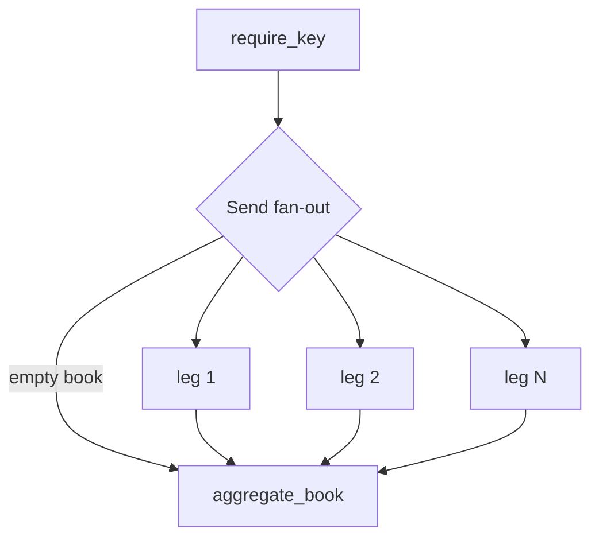

# Explain My Option

**Explain My Option** explains why an equity option's price moved from yesterday to today. It refuses when it cannot explain the move, and stays silent when there is nothing to explain. QuantLib computes the attribution with no LLM involved. An LLM writes the diagnosis against that blotter, cannot introduce a figure that is not in it, and is cut off when the unexplained portion stays large. The numbers that decide whether to escalate, abstain, or stay quiet are computed without the model that would benefit from a different answer.

A **governed diagnostic agent**: QuantLib produces the blotter; the LLM only writes a diagnosis against it. Explain, don't predict. The LLM does not own PnL.

This is a personal project, in progress — not a production desk system. LangGraph is the runtime. The tool controller, search planner and verifier are rules in this repo, not LLM decisions.

**Why this exists:** funds talk about “AI in the workflow.” Chat UIs and coding IDEs speed up *people*. This repo is a **coded, repeatable desk step** — fixed stages, budgets, abstain rules, and a blotter the narrative must reconcile to.

## Design (what to look at)

1. **Numbers first.** Official 1-day PnL comes from QuantLib American FDM. The LLM cannot introduce a dollar figure.
2. **Policy before LLM.** A **rules** controller may run at most 1 costly diagnostic tool (plus a few free arithmetic ones that do not use the budget) and logs skip reasons. This is not free-form ReAct; the agent does not pick engines.
3. **Three roles.** Narrator / catalyst critic (headline whitelist) / verifier. FAIL on invented dollars; PARTIAL if a named catalyst is missing. [Case studies](docs/case-studies/README.md)
4. **Gated search.** Rules planner (no LLM by default). Extra Tavily / 8-K only on blotter cues; quiet or locked observations skip news.
5. **Escalate, don't invent.** Budget exhausted with a large residual or mark gap → unexplained (`terminal_unexplained_break`). Layer A is the modeled Taylor / Greek ranking from code; Layer B is a named catalyst / unmodeled gap. Residual truncation does **not** replace Layer B.

## Sample output

Five reports from real runs live in [`docs/samples/`](docs/samples/README.md) — see that README for the exact command, model, data source, and real-vs-synthetic status of each. Suite `output/` stays gitignored.

| Capture | File |
|---------|------|
| **Abstain** (constructed demo) — budget exhausted, terminal break | [sample_abstain.md](docs/samples/sample_abstain.md) |
| **Quiet day** — nothing to explain, no search performed | [sample_quiet_day.md](docs/samples/sample_quiet_day.md) |
| Real ex-div chain, market ΔP + mark reconciliation | [sample_real_chain.md](docs/samples/sample_real_chain.md) |
| `--no-llm`, zero LLM calls, live quote | [sample_no_llm.md](docs/samples/sample_no_llm.md) |
| Prompt injection contained | [sample_injection_contained.md](docs/samples/sample_injection_contained.md) |

`sample_abstain.md` is a **constructed demonstration of the abstain mechanism**, not a captured natural failure: the market data, Greeks and routing are real, but the narrator is a scripted role that deliberately claims a dollar figure absent from the blotter (a real narrator on this same case produced a well-explained PARTIAL; see [docs/samples/README.md](docs/samples/README.md)). For how the verifier behaves against real and adversarial narrations, see the red-team study ([docs/studies/redteam_results.md](docs/studies/redteam_results.md)). Truncated (sections 1, 4, 5). Numbers are QuantLib; the LLM's own text is the `verdict`/`Confidence` lines only:

```markdown
# Option Price Movement Diagnostic Report

**Contract**: `GME 55P 2021-02-19`
**Analysis Date**: `2021-01-25` | **Status**: Verified by QuantLib (fdm_flat)

## 1. Headline

* **Mark MTM PnL**: `+$1.6000` (+12.1%)
* **Model ΔP**: `+$1.6000`
* **Primary drivers**: **Vega PnL** (53%) and **Delta PnL** (31%) and **Theta decay** (9%).
* **Verifier**: FAIL — hard policy violation; escalate before trading on story.
* **Verdict**: Verifier FAIL — terminal break escalation. validate_synthesis failed
* **Confidence**: **Medium** — Vega dominated the Taylor decomposition.

## 4. Quantitative PnL Attribution

| Attribution Component | Value ($) | % Share |
| :--- | ---: | ---: |
| **Delta PnL (ΔS · Delta)** | `-$3.3487` | +31.1% |
| **Gamma PnL (½(ΔS)² · Gamma)** | `+$0.4858` | +4.5% |
| **Vega PnL (Δσ · Vega)** | `+$5.6937` | +52.9% |
| **Theta decay (Δt · Theta)** | `-$0.9358` | +8.7% |
| **Unexplained residual (ε)** | `-$0.2948` | +2.7% |
| **Total Model PnL** | **+$1.6000** | **100.0%** |

## 5. Residual Drill

* **Taylor residual**: `-$0.2948` (18.4% of |model|)
* **Terminal break**: diagnostic budget exhausted with large unexplained residual/gap — escalate to human review before trading on factor stories.

* **Tools run** (4 total; costly 1/1, free tools do not use the budget): `reconcile_mark_vs_model`, `quote_quality_and_noise_band`, `taylor_second_order`, `path_reprice`
```

Full report, and a disclosure of how this specific file was produced: [docs/samples/README.md](docs/samples/README.md).

## 1-day attribution

Greek-based / Taylor (the shipped blotter):

$$\Delta P_{model} \approx \Delta \cdot \Delta S + \tfrac12\Gamma(\Delta S)^2 + \mathcal{V}_{raw}\cdot\Delta\sigma + \tfrac12\,\text{Volga}_{raw}(\Delta\sigma)^2 + \text{Vanna}_{raw}\cdot\Delta S\cdot\Delta\sigma + \Theta_{raw}\cdot\Delta t + \varepsilon_{method}$$

Second-order vol terms are part of the shipped blotter, free and always computed. When the move is too large for a Taylor expansion to be valid, full revaluation becomes the headline attribution (see [Regime rule](#regime-rule)).

When the leftover residual is large, a diagnostic pass may also run **sequential full revaluation** (order **t → S → σ → r**) on the same official engine. That path is an audit of the Taylor blotter, not a second official PnL.

## Validation

The pricing layer is checked against arbitrage and numerical invariants, not only golden outputs (`tests/ci/test_pricing_invariants.py`):

| Property | Asserted |
|---|---|
| Put-call parity, European limit with discrete dividends | `C − P = (S − PV(D)) − K e^{−rT}` |
| American call, no dividends | equals the European call |
| Early exercise premium | `≥ 0` vs a same-dividend European baseline |
| FDM grid convergence | successive differences shrink; observed order reported |
| Bumped Greeks vs closed-form BS (European limit) | Δ, Γ, Vega, Θ |
| Taylor decomposition | components + residual reconstruct model ΔP to 1e-9 |
| Reference prices | published American put benchmark values |
| Implied borrow | recovered from put-call parity within 1e-3 on a known-q chain |

## Two residuals

Every run carries two distinct residuals, not one. `ε_method` is the gap between the model's own PnL and what the Taylor / second-order decomposition explains — pure arithmetic (truncation, discretization, American-exercise effects), and a catalyst may never be blamed for it. `ε_model` is the gap between the market's real price change and the model's — the only residual a news catalyst may legitimately explain — but it exists only when reliable marks are available on both dates. Escalation is driven by `ε_model` when reliable marks exist and by `ε_method` otherwise, and every report labels which basis (`escalation_basis`) is active.

## Regime rule

A Taylor expansion is local: on a large gap it does not converge slowly, it diverges. Before looking at the residual, the code decides whether the Taylor decomposition is even valid for this move:

```
r_spot = |½·Γ·(ΔS)²|         / |Δ·ΔS|
r_vol  = |½·Volga_raw·(Δσ)²| / |Vega_raw·Δσ|
taylor_regime = "INVALID" if max(r_spot, r_vol) > 0.35 else "VALID"
```

`VALID` → the Taylor decomposition is the headline attribution; full revaluation is a cross-check. `INVALID` → full revaluation becomes the headline attribution; the Taylor split is printed for reference only. The `0.35` cutoff is provisional — computed on every case available this session:

| Case | `r_spot` | `r_vol` | `|ε_method|/|ΔP|` | Regime |
|---|---:|---:|---:|---|
| AAPL ex-div (real chain) | 0.0188 | 0.0088 | 0.0056 | VALID |
| GME squeeze (real chain) | 0.1451 | 0.0247 | 0.1843 | VALID |
| AAPL quiet day (real chain) | 0.0098 | 0.0001 | 0.5908 | VALID |
| VW float squeeze (stress fixture) | 8.0283 | 0.5248 | 0.8783 | INVALID |
| `vol_crush` (stress fixture) | 0.0185 | 0.0003 | 0.0435 | VALID |

Every real and realistic case sits at least an order of magnitude below `0.35`; the one genuinely convex, control-event squeeze (VW) sits more than twenty times above it — the cutoff has room on both sides of the cases actually observed, not a value tuned to split a close call.

## What the offline suite covers

| Gate | Where |
|------|--------|
| No invented dollars / observation lock / missing catalyst / unexplained break | `tests/ci/test_governance_scorecard.py` |
| Ex-div FO overlay (not an edge claim) | `tests/ci/test_exdiv_attribution.py` · [walkthrough](docs/case-studies/aapl_exdiv_attribution.md) |
| Residual is the hard bar; narrative is not a published score | [case-studies README](docs/case-studies/README.md) |

```bash
./scripts/run-tests.sh
```

The CI suite does not call a live LLM. Historical `run.py` is a separate, keyed eval.

These are unit tests of the verifier's rules against fixed synthesis fixtures. For an end-to-end measurement — detection rate, miss rate, and false-alarm rate against a constructed attack set on real blotters — see `docs/studies/redteam_results.md`.

## Try it

Python 3.11+.

```bash
python -m venv .venv && source .venv/bin/activate
pip install -r requirements.txt

./scripts/run-tests.sh
```

Copy `.env.example` → `.env`. Default runtime requires `OPENAI_API_KEY` (entry gate). Optional keys and the chat model are listed there (`EMO_LLM_MODEL`, `TAVILY_API_KEY`, `EMO_SEC_USER_AGENT`, `LANGSMITH_API_KEY`). Never commit `.env`.

```bash
python app.py --ticker AAPL --type call
python app.py --ticker TSLA --type put --strike 250 --expiry 2026-01-16
python app.py --fixture vol_crush
python app.py --book tests/ci/fixtures/books/demo_book.json
```

```bash
streamlit run app.py
```

| Suite | What | Command |
|-------|------|---------|
| `tests/ci/` | Engine, graph, report (offline) | `./scripts/run-tests.sh` |
| `tests/historical/` | Event fixtures with frozen as-of news | `python tests/historical/run.py` |
| `tests/live_book/` | Recent book / archive replay | `python tests/live_book/portfolio_e2e.py --offline` |

Layout and notebooks: [tests/README.md](tests/README.md) · [notebooks/README.md](notebooks/README.md).

## Historical cases

**Historical cases (real chains)** — real quotes both days, from DoltHub
`post-no-preference/options` (`src/explain_my_option/data/historical_chain.py`).

| Case | As-of | Desk lesson | Walkthrough |
|------|-------|-------------|-------------|
| GME squeeze (real) | 2021-01-25 | Real IV ~308% → 358%, borrow regime `extreme` (`q_implied` ≈ 58%) | — |
| AAPL ex-div (real) | 2023-11-09 | Real dividend ($0.24, ex 2023-11-10); Taylor misses the div vs early-exercise split | [aapl_exdiv_attribution.md](docs/case-studies/aapl_exdiv_attribution.md) |

**Stress fixtures (synthetic inputs)** — hand-chosen spot and implied vol to
force specific residual regimes. Regression tests for the attribution code;
not evidence about any real trading day (`tests/ci/stress_fixtures/README.md`).

| Case | As-of | Desk lesson | Walkthrough |
|------|-------|-------------|-------------|
| META earnings gap | 2022-02-03 | Overnight gap + IV crush on the blotter | — |
| AAPL ex-div (synthetic) | 2023-11-09 | Taylor misses the div vs early-exercise split | [aapl_exdiv_attribution.md](docs/case-studies/aapl_exdiv_attribution.md) |
| GME squeeze (synthetic) | 2021-01-25 | Borrow / squeeze is tape context, not an engine factor | — |
| VW float squeeze | 2008-10-27 | Large residual → escalate, don't invent | [vow_float_squeeze_2008.md](docs/case-studies/vow_float_squeeze_2008.md) |
| VMW HTB | 2008-01-28 | Borrow is not modeled → low residual is expected | — |

Index: [docs/case-studies/README.md](docs/case-studies/README.md).

## Scope

- Official PnL: American FDM (`FdBlackScholesVanillaEngine`). Local vol when Dupire is safe; otherwise flat IV.
- Heston is diagnostic-only. LSM-BS / LSM-Merton are an analysis API, not the `quant` node.
- Real historical option chains (DoltHub, ~2019+, US-listed only) back the
  two real cases above; live `iv_prev` still resolves via SQLite t-1, else
  HV20 proxy. Coverage gaps, strike-window bias and licensing:
  `docs/dev/DATA_SOURCES.md`.
- Second-order vol terms (vanna, volga) are part of the shipped blotter,
  free and always computed. Charm and rho are not modelled; on a one-day
  equity horizon both sit below the reporting threshold.
- Early exercise premium is measured against a European with the same
  dividend schedule.
- Escalation is driven by the market-versus-model residual when reliable
  marks exist, and by the method residual otherwise, always labelled.
- No end-to-end measurement of LLM violation rates existed before
  `docs/studies/redteam_results.md`; see its stated sample size.
- `--book` is per-leg fan-out + roll-up, not cross-gamma.
- Users cannot custom-prompt or pick an alternate path.
- Not in scope: trading edge, price prediction, book-level cross-gamma.

This is not trading advice and not a price forecast.

## Architecture

Book-first parent graph. `Send` fans out **in parallel** — one compiled leg subgraph per position. Single-leg CLI/UI is the same graph with one leg. Users cannot pick a path; the loops below are budgeted graph edges, not ReAct. Live diagrams: [langgraph_architecture.ipynb](notebooks/langgraph_architecture.ipynb).



Each `leg_branch` is this subgraph (`fetch` / `quant` / `blotter` have **no LLM**):


