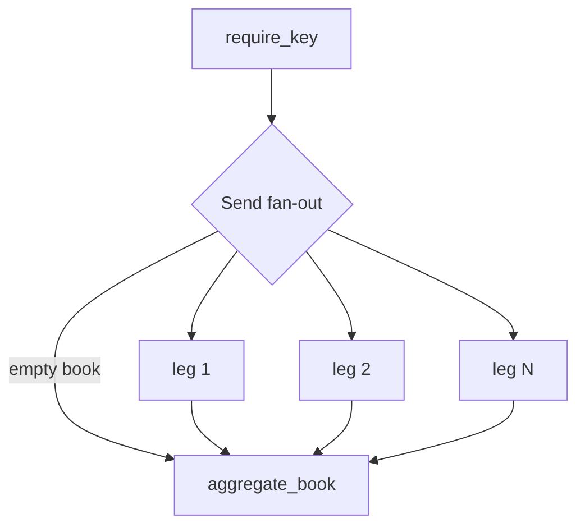
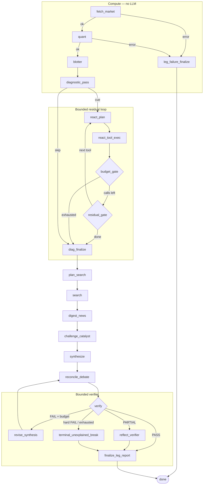

# Explain My Option

A **governed diagnostic agent**: QuantLib produces the blotter; the LLM only writes a diagnosis against it. Explain, don't predict. The LLM does not own PnL.

This is a personal project, in progress — not a production desk system. LangGraph is the runtime; **policy is this repo**.

**Why this exists:** funds talk about “AI in the workflow.” Chat UIs and coding IDEs speed up *people*. This repo is a **coded, repeatable desk step** — fixed stages, budgets, abstain rules, and a blotter the narrative must reconcile to.

## Design (what to look at)

1. **Numbers first.** Official 1-day PnL comes from QuantLib American FDM. The LLM cannot introduce a dollar figure.
2. **Policy before LLM.** A **rules** controller may run ≤3 diagnostic tools and logs skip reasons. This is not free-form ReAct; the agent does not pick engines.
3. **Three roles.** Narrator / catalyst critic (headline whitelist) / verifier. FAIL on invented dollars; PARTIAL if a named catalyst is missing. [Case studies](docs/case-studies/README.md)
4. **Gated search.** Rules planner (no LLM by default). Extra Tavily / 8-K only on blotter cues; quiet or locked observations skip news.
5. **Escalate, don't invent.** Budget exhausted with a large residual or mark gap → unexplained (`terminal_unexplained_break`). Layer A is the modeled Taylor / Greek ranking from code; Layer B is a named catalyst / unmodeled gap. Residual truncation does **not** replace Layer B.

## Sample output

Three frozen reports live in [`docs/samples/`](docs/samples/README.md). Suite `output/` stays gitignored.

| Capture | File |
|---------|------|
| Live public ticker, qty 1 | [live.md](docs/samples/live.md) |
| META 2022 earnings gap | [historical.md](docs/samples/historical.md) |
| VW 2008 squeeze — abstain | [unexplained_break.md](docs/samples/unexplained_break.md) |

Truncated `unexplained_break.md` (sections 1–5). Numbers are QuantLib; the LLM only wrote the verdict against that blotter:

```markdown
# Option Price Movement Diagnostic Report

**Contract**: `VOW.DE 300C 2008-12-19`
**Analysis Date**: `2008-10-27` | **Status**: Verified by QuantLib (fdm_flat)

## 1. Headline

* **Model PnL (no mark)**: `+$706.2085` (+11593.1%)
* **Model ΔP**: `+$706.2085`
* **Primary drivers**: **Gamma PnL** (60%) and **Delta PnL** (7%).
* **Verifier**: PARTIAL — narrative shipped with caveats (reflect applied).
* **Verdict**: Reflect (PARTIAL): The blotter is dominated by gamma: the option behaved like a high-convexity instrument into a very large spot jump, so the Taylor bucket is led by convexity rather than linear delta. Layer B adds an issuer-specific control-structure catalyst: Porsche’s large voting-stake disclosure and the resulting reduced free float support a float and squeeze tape, with borrow stress likely amplifying the move; the large residual is consistent with higher-order truncation on top of that tape. …
* **Confidence**: **Medium** — … the residual is large, so higher-order terms and market-structure effects matter.

## 4. Quantitative PnL Attribution

| Attribution Component | Value ($) | % Share |
| :--- | ---: | ---: |
| **Delta PnL (ΔS · Delta)** | `+$145.0401` | +20.5% |
| **Gamma PnL (½(ΔS)² · Gamma)** | `+$1,164.4252` | +164.9% |
| **Vega PnL (Δσ · Vega)** | `+$17.1675` | +2.4% |
| **Theta decay (Δt · Theta)** | `-$0.1799` | -0.0% |
| **Unexplained residual (ε)** | `-$620.2445` | -87.8% |
| **Total Model PnL** | **+$706.2085** | **100.0%** |

## 5. Residual Drill

* **Taylor residual**: `-$620.2445` (87.8% of |model|)
* **Terminal break**: diagnostic budget exhausted with large unexplained residual/gap — escalate to human review before trading on factor stories.

### Sequential full revaluation (Layer 4, t → S → σ → r)
* **time**: `-$0.1799` · **spot**: `+$700.7099` · **vol**: `+$5.6785`
* Step sum: `+$706.2085` | Model ΔP: `+$706.2085` | Audit residual: `-$0.0000`

* **Tools run** (1/3): `path_reprice`
```

News, watchlist, and the uncut verdict: [unexplained_break.md](docs/samples/unexplained_break.md).

## 1-day attribution

Greek-based / Taylor (the shipped blotter):

$$\Delta P \approx \Delta \cdot \Delta S + \tfrac12\Gamma(\Delta S)^2 + \mathcal{V}\cdot\Delta\sigma + \Theta\cdot\Delta t + \text{residual}$$

When the leftover residual is large, a diagnostic pass may also run **sequential full revaluation** (order **t → S → σ → r**) on the same official engine. That path is an audit of the Taylor blotter, not a second official PnL.

## What is proven offline

| Gate | Where |
|------|--------|
| No invented dollars / observation lock / missing catalyst / unexplained break | `tests/ci/test_governance_scorecard.py` |
| Ex-div FO overlay (not an edge claim) | `tests/ci/test_exdiv_attribution.py` · [walkthrough](docs/case-studies/aapl_exdiv_attribution.md) |
| Residual is the hard bar; narrative is not a published score | [case-studies README](docs/case-studies/README.md) |

```bash
./scripts/run-tests.sh
```

The CI suite does not call a live LLM. Historical `run.py` is a separate, keyed eval.

## Try it

Python 3.11+.

```bash
python -m venv .venv && source .venv/bin/activate
pip install -r requirements.txt

./scripts/run-tests.sh
```

Copy `.env.example` → `.env`. Default runtime requires `OPENAI_API_KEY` (entry gate). Optional keys and the chat model are listed there (`EMO_LLM_MODEL`, `TAVILY_API_KEY`, `EMO_SEC_USER_AGENT`, `LANGSMITH_API_KEY`). Never commit `.env`.

```bash
python app.py --ticker AAPL --type call
python app.py --ticker TSLA --type put --strike 250 --expiry 2026-01-16
python app.py --fixture vol_crush
python app.py --book tests/ci/fixtures/books/demo_book.json
```

```bash
streamlit run app.py
```

| Suite | What | Command |
|-------|------|---------|
| `tests/ci/` | Engine, graph, report (offline) | `./scripts/run-tests.sh` |
| `tests/historical/` | Event fixtures with frozen as-of news | `python tests/historical/run.py` |
| `tests/live_book/` | Recent book / archive replay | `python tests/live_book/portfolio_e2e.py --offline` |

Layout and notebooks: [tests/README.md](tests/README.md) · [notebooks/README.md](notebooks/README.md).

## Historical cases

Synthetic fixtures with frozen as-of news. Headlines must have `published <= as_of`.

| Case | As-of | Desk lesson | Walkthrough |
|------|-------|-------------|-------------|
| META earnings gap | 2022-02-03 | Overnight gap + IV crush on the blotter | — |
| AAPL ex-div | 2023-11-09 | Taylor misses the div vs early-exercise split | [aapl_exdiv_attribution.md](docs/case-studies/aapl_exdiv_attribution.md) |
| GME squeeze | 2021-01-25 | Borrow / squeeze is tape context, not an engine factor | — |
| VW float squeeze | 2008-10-27 | Large residual → escalate, don't invent | [vow_float_squeeze_2008.md](docs/case-studies/vow_float_squeeze_2008.md) |
| VMW HTB | 2008-01-28 | Borrow is not modeled → low residual is expected | — |

Index: [docs/case-studies/README.md](docs/case-studies/README.md).

## Scope

- Official PnL: American FDM (`FdBlackScholesVanillaEngine`). Local vol when Dupire is safe; otherwise flat IV.
- Heston is diagnostic-only. LSM-BS / LSM-Merton are an analysis API, not the `quant` node.
- No historical option chain. Live `iv_prev`: SQLite t-1, else HV20 proxy.
- `--book` is per-leg fan-out + roll-up, not cross-gamma.
- Users cannot custom-prompt or pick an alternate path.
- Not in scope: trading edge, price prediction, book-level cross-gamma.

This is not trading advice and not a price forecast.

## Architecture

Book-first parent graph. `Send` fans out **in parallel** — one compiled leg subgraph per position. Single-leg CLI/UI is the same graph with one leg. Users cannot pick a path; the loops below are budgeted graph edges, not ReAct. Live diagrams: [langgraph_architecture.ipynb](notebooks/langgraph_architecture.ipynb).



Each `leg_branch` is this subgraph (`fetch` / `quant` / `blotter` have **no LLM**):


