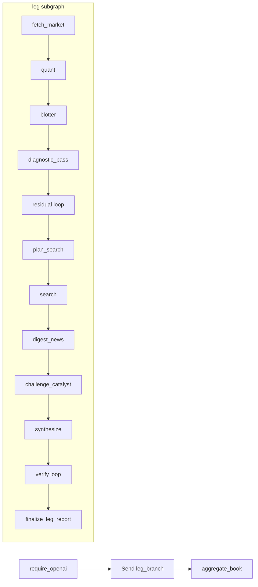

# Explain My Option

A **governed diagnostic agent**: QuantLib produces the blotter; the LLM only writes a diagnosis against it. Explain, don't predict. The LLM does not own PnL.

This is a personal project, in progress — not a production desk system. LangGraph is the runtime; **policy is this repo**.

## Design (what to look at)

1. **Numbers first.** Official 1-day PnL comes from QuantLib American FDM. The LLM cannot introduce a dollar figure.
2. **Policy before LLM.** A **rules** controller may run ≤3 diagnostic tools and logs skip reasons. This is not free-form ReAct; the agent does not pick engines.
3. **Three roles.** Narrator writes against the blotter. An independent catalyst critic may only keep mechanism tags from a **code scan** of relevant headlines (whitelist). Verifier + deterministic precheck: FAIL on numeric hallucination; PARTIAL if Layer B (named catalyst) is missing. Code can suppress Vega / IV-crush when quotes are noise.
4. **Gated search.** Cue-based planner (default **no LLM**): extra Tavily / 8-K only on blotter cues; quiet or locked observations skip news. Missing keys skip fail-soft.
5. **Escalate, don't invent.** Budget exhausted with a large residual or mark gap → unexplained (`terminal_unexplained_break`). Layer A is the modeled Taylor / Greek ranking from code; Layer B is a named catalyst / unmodeled gap. Residual truncation does **not** replace Layer B.

## 1-day attribution

Greek-based / Taylor (the shipped blotter):

$$\Delta P \approx \Delta \cdot \Delta S + \tfrac12\Gamma(\Delta S)^2 + \mathcal{V}\cdot\Delta\sigma + \Theta\cdot\Delta t + \text{residual}$$

When the leftover residual is large, a diagnostic pass may also run **sequential full revaluation** (order **t → S → σ → r**) on the same official engine. That path is an audit of the Taylor blotter, not a second official PnL.

## Try it

Python 3.11+.

```bash
python -m venv .venv && source .venv/bin/activate
pip install -r requirements.txt

./scripts/run-tests.sh
```

Copy `.env.example` → `.env`. Default runtime requires `OPENAI_API_KEY` (entry node). Optional: `EMO_LLM_MODEL` (code default `gpt-5.4-mini`), `TAVILY_API_KEY`, `EMO_SEC_USER_AGENT`, `LANGSMITH_API_KEY`. Never commit `.env`.

```bash
python app.py --ticker AAPL --type call
python app.py --ticker TSLA --type put --strike 250 --expiry 2026-01-16
python app.py --fixture vol_crush
python app.py --book tests/ci/fixtures/books/demo_book.json
```

```bash
streamlit run app.py
```

| Suite | What | Command |
|-------|------|---------|
| `tests/ci/` | Engine, graph, report (offline) | `./scripts/run-tests.sh` |
| `tests/historical/` | Event fixtures with frozen as-of news | `python tests/historical/run.py` |
| `tests/live_book/` | Recent book / archive replay | `python tests/live_book/portfolio_e2e.py --offline` |

Layout and notebooks: [tests/README.md](tests/README.md) · [notebooks/README.md](notebooks/README.md).

## Historical cases

Synthetic fixtures with frozen as-of news. Headlines must have `published <= as_of`.

| Case | As-of | Walkthrough |
|------|-------|-------------|
| META earnings gap | 2022-02-03 | — |
| AAPL ex-div | 2023-11-09 | [aapl_exdiv_attribution.md](docs/case-studies/aapl_exdiv_attribution.md) |
| GME squeeze | 2021-01-25 | — |
| VW float squeeze | 2008-10-27 | [vow_float_squeeze_2008.md](docs/case-studies/vow_float_squeeze_2008.md) |
| VMW HTB | 2008-01-28 | Borrow cost is not in the official engine |

Index: [docs/case-studies/README.md](docs/case-studies/README.md).

## Scope

- Official PnL: American FDM (`FdBlackScholesVanillaEngine`). Local vol when Dupire is safe; otherwise flat IV.
- Heston is diagnostic-only. LSM-BS / LSM-Merton are an analysis API, not the `quant` node.
- No historical option chain. Live `iv_prev`: SQLite t-1, else HV20 proxy.
- `--book` is per-leg fan-out + roll-up, not cross-gamma.
- Users cannot custom-prompt or pick an alternate path.
- Not in scope: trading edge, price prediction, book-level cross-gamma.

This is not trading advice and not a price forecast.

## Architecture

Book-first parent graph with `Send` fan-out per leg. Single-leg CLI/UI is one leg in the same graph. Live diagrams: [langgraph_architecture.ipynb](notebooks/langgraph_architecture.ipynb).


