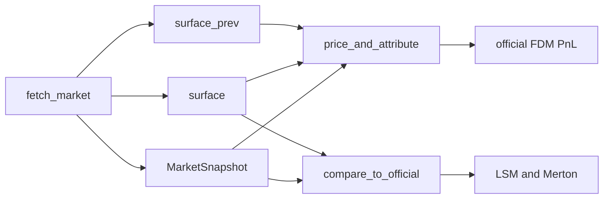

# Pricing engine map

## Takeaway

Official 1-day PnL is American FDM (`price_and_attribute`). Local vol when Dupire is safe; otherwise flat IV. LSM-BS / LSM-Merton / European Merton live on `analysis_api.compare_to_official` (diagnostic tools, not the `quant` node). Methods swap via `EngineConfig` / `EMO_PRICING_ENGINE` without changing the graph.

## Data lineage (live)

| Snapshot field | Source |
|----------------|--------|
| `spot_now` / `spot_prev` | `Ticker.history` last two closes |
| `iv_now` | chain `impliedVolatility` (fallback 0.30) |
| `iv_prev` | SQLite t-1 `iv_now`, else HV20 proxy |
| `option_price_now` | bid/ask mid, else last |
| `risk_free_rate` | `^IRX` / 100, else 0.045 |
| `dividend_yield` | `info.dividendYield` |
| `discrete_dividends` | `tk.dividends` + projected next 1–2 cash amounts |
| `VolSurfaceData` | today's multi-expiry chain grid |
| `surface_prev` | t-1 cache or parallel-shifted today grid |

Synthetic fixtures never apply the HV20 proxy (`iv_prev_source=fixture`).

## Official vs analysis

Dupire probe + `illegalLocalVolOverwrite` protect sparse Yahoo grids. `DividendVanillaOption` construct+NPV is wrapped. LSM unit tests use 4096 paths, 50 steps, seed 42.

## Source

- `src/pricing/facade.py`, `src/pricing/registry.py`, `src/pricing/analysis_api.py`
- Tests: `tests/ci/test_pricing_facade.py`, golden Markdown in `tests/ci/golden/`
